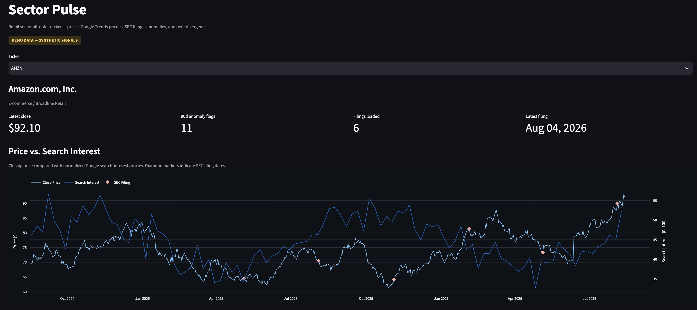
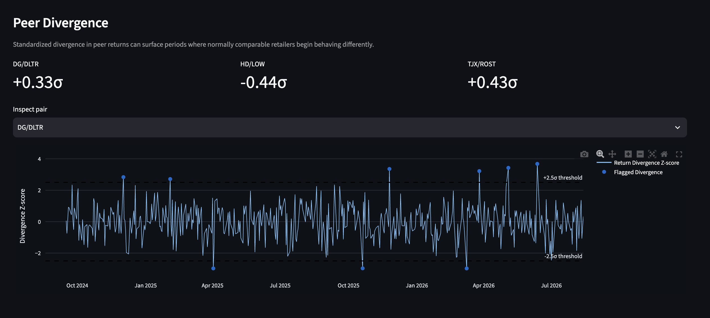

# Sector Pulse

Sector Pulse is a retail/consumer-discretionary alt-data tracker that joins market prices, Google search-interest proxies, and SEC filings in DuckDB, removes recurring seasonal structure with STL, and screens residuals for unusual moves with rolling z-scores. It also measures return divergence for three intuitive peer pairs: **HD/LOW, TJX/ROST, and DG/DLTR**.

The repository is designed to run in two modes:

* **Demo mode** uses deterministic synthetic data. `make demo` persists it to `data/sample.duckdb`; if that file is absent, the dashboard can create the same demo dataset in memory at startup.
* **Live mode** pulls price history with `yfinance`, search interest with `pytrends`, and filing/XBRL data from SEC EDGAR.

> **Note:** The screenshots below use deterministic synthetic demo data. They illustrate the application's functionality and should not be interpreted as observations about actual companies or market conditions.

## What the dashboard answers

* Is a retailer's price, trading volume, or brand-search interest unusually high or low after removing recurring seasonality?
* Do search-interest movements occur near price moves or SEC filing dates?
* Are economically similar retailers diverging more than their recent relationship would suggest?
* How are reported revenue, cost of goods sold, and inventory evolving quarter to quarter?

## Dashboard

The dashboard combines company-level market data, search-interest proxies, SEC filing markers, and anomaly signals in a single monitoring interface.



### Peer Divergence

Peer-pair monitoring highlights unusually large standardized return divergences across comparable retailers. The dashboard tracks **DG/DLTR, HD/LOW, and TJX/ROST** and flags observations that cross the configured z-score threshold.



## Universe

```text
AMZN, WMT, TGT, COST, HD, LOW, TJX, ROST, BBY, NKE, LULU, ULTA, DG, DLTR
```

The universe is configured in [`config/tickers.yaml`](config/tickers.yaml) with company name, subsector, and 1–2 Google Trends keywords per ticker.

## Architecture

```text
Yahoo Finance ─┐
Google Trends ─┼─> validation/cache ─> DuckDB ─> STL seasonality ─> rolling z-score ─┐
SEC EDGAR ─────┘                                                                  ├─> Streamlit
Peer prices ─────────────────────────────────────────────> pair divergence ────────┘
```

Core tables:

* `dim_ticker`
* `fact_price`
* `fact_trends`
* `fact_filings`
* `fact_financials`
* `fact_seasonality`
* `fact_anomaly`
* `fact_pair_divergence`

## Quick Start

### 1. Create the environment

```bash
python -m venv .venv
source .venv/bin/activate

python -m pip install --upgrade pip
pip install -r requirements.txt
```

### 2. Build the demo database

```bash
make demo
```

This creates:

```text
data/sample.duckdb
```

### 3. Run validation

```bash
make verify
```

The verification command runs the test suite and performs an offline demo-database integrity check.

### 4. Launch the dashboard

```bash
make dashboard
```

Streamlit will display a local URL, typically:

```text
http://localhost:8501
```

## Live Refresh

Create `.env` from `.env.example`, then provide a descriptive SEC User-Agent before running live ingestion:

```bash
export SEC_USER_AGENT="SectorPulse your_email@example.com"

python -m src.run_pipeline \
  --mode live \
  --db data/warehouse.duckdb
```

Then launch the dashboard against the live database:

```bash
SECTOR_PULSE_DB=data/warehouse.duckdb streamlit run dashboard/app.py
```

### Useful live-pipeline options

Faster smoke test on a peer pair:

```bash
python -m src.run_pipeline \
  --mode live \
  --db data/warehouse.duckdb \
  --tickers HD LOW
```

Skip Google Trends calls and reuse previously loaded trend rows:

```bash
python -m src.run_pipeline \
  --mode live \
  --db data/warehouse.duckdb \
  --skip-trends
```

Force a refresh of cached Google Trends data:

```bash
python -m src.run_pipeline \
  --mode live \
  --db data/warehouse.duckdb \
  --force-trends
```

## Transform Logic

### Seasonality

For price and volume, STL uses a 5-trading-day period to remove recurring weekly structure. For weekly Google Trends series, STL uses a 52-week period.

The resulting residual component becomes the input to anomaly detection.

### Anomaly Screening

For price and volume residuals, Sector Pulse calculates a trailing 60-observation z-score using only prior observations.

Google Trends series use a 26-week rolling window because of their lower frequency.

An observation is flagged when:

```text
|z| > 2.5
```

The dashboard presents the output statistically, for example:

> `HD price 3.0σ above its trailing residual mean`

The application does **not** infer causality or label statistical anomalies as investment alpha.

### Peer Divergence

For **HD/LOW, TJX/ROST, and DG/DLTR**, the pipeline computes the daily return spread:

```text
return_a - return_b
```

It then calculates a trailing z-score for that spread.

This provides a compact screen for identifying periods when the returns of normally comparable retailers diverge unusually far from their recent relationship.

## Example Analysis Workflow

1. Select a retailer from the dashboard.
2. Review its latest price and recent anomaly count.
3. Compare price behavior with the aggregated search-interest series.
4. Inspect nearby 10-Q, 10-K, or 8-K filing markers.
5. Review the latest statistically flagged signal.
6. Examine the anomaly table and recent financial facts.
7. Compare the retailer's configured peer pair for unusual relative-return divergence.
8. Use [`sql/analysis_queries.sql`](sql/analysis_queries.sql) for deeper inspection of financial trends and large divergence events.

The demo database is synthetic, so any signals shown in demo mode are **illustrative**. A live refresh is required before making statements about actual companies or market events.

## Data Sources and Caveats

### Market prices

`yfinance` is used to retrieve historical market data from Yahoo Finance.

Because it depends on an external upstream service, requests may occasionally be affected by throttling or API changes.

### Search interest

`pytrends` is used as an unofficial Google Trends client.

Google Trends values are relative indices rather than absolute search volumes. The service can also be rate-limit prone, so Sector Pulse:

* caches raw responses under `data/raw/trends/`
* retries failed requests with backoff
* supports skipping trend refreshes when cached data is already available

### SEC filings

SEC filing metadata and Company Facts are retrieved from `data.sec.gov`.

Live requests require a descriptive User-Agent.

The pipeline normalizes selected XBRL facts including:

* revenue
* cost of goods sold
* inventory

## Testing and Validation

Run the complete project verification with:

```bash
make verify
```

The current validation workflow includes unit coverage for:

* price normalization and validation
* SEC financial-fact normalization
* seasonality transformation
* anomaly detection
* peer-divergence calculations
* DuckDB integration

GitHub Actions runs the automated test workflow on pushes and pull requests.

## Repository Layout

```text
sector-pulse/
├── .github/
│   └── workflows/
│       └── ci.yml
├── config/
│   └── tickers.yaml
├── dashboard/
│   └── app.py
├── data/
│   └── README.md
├── docs/
│   ├── screenshots/
│   │   ├── dashboard-overview.png
│   │   └── peer-divergence.png
│   └── sample-signal-preview.png
├── notebooks/
│   └── exploration.ipynb
├── scripts/
│   └── verify_project.py
├── sql/
│   └── analysis_queries.sql
├── src/
│   ├── db.py
│   ├── demo.py
│   ├── run_pipeline.py
│   ├── ingest/
│   │   ├── prices.py
│   │   ├── trends.py
│   │   └── sec_filings.py
│   └── transform/
│       ├── seasonality.py
│       ├── anomaly.py
│       └── divergence.py
├── tests/
├── Makefile
├── README.md
├── requirements.txt
└── VALIDATION.md
```

Generated DuckDB files are intentionally excluded from version control. Use `make demo` to rebuild the deterministic sample database locally.

> Built a Python/DuckDB alt-data pipeline integrating retail price, search-interest, and SEC filing data across 14 tickers; applied STL seasonality decomposition, rolling z-score anomaly screening, and peer-return divergence analysis in a Streamlit dashboard.

## Disclaimer

Sector Pulse is an analytical engineering project. It is not an investment recommendation system, and statistical anomalies identified by the application should not be interpreted as evidence of causality or expected future returns.
